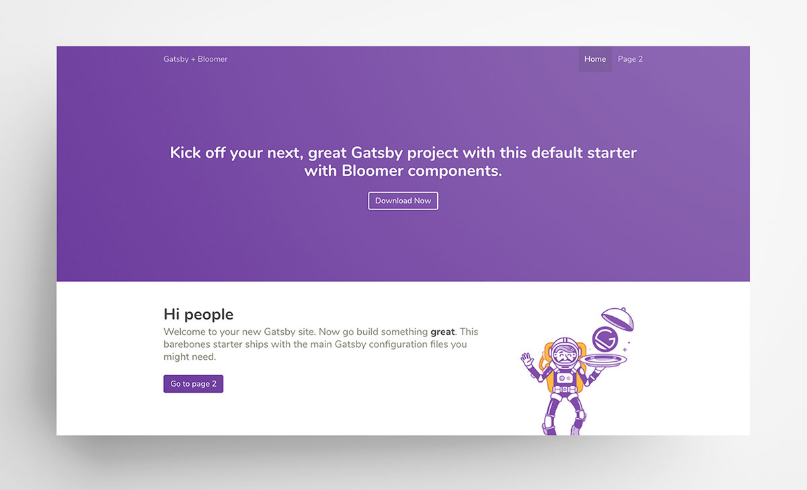

<!-- Status Badges -->

# Gatsby Starter Bloomer

This is a barebones Gatsby starter with Bloomer React components. Use this starter to get up and running quickly with your next Gatsby project.

[View Demo](https://gatsby-starter-bloomer-db0aaf.netlify.com/)

## Features

- Sass Ready
- Font Awesome Icons
- Progressive Web App
- Sticky footer

<!-- Deploy to Netlify -->

